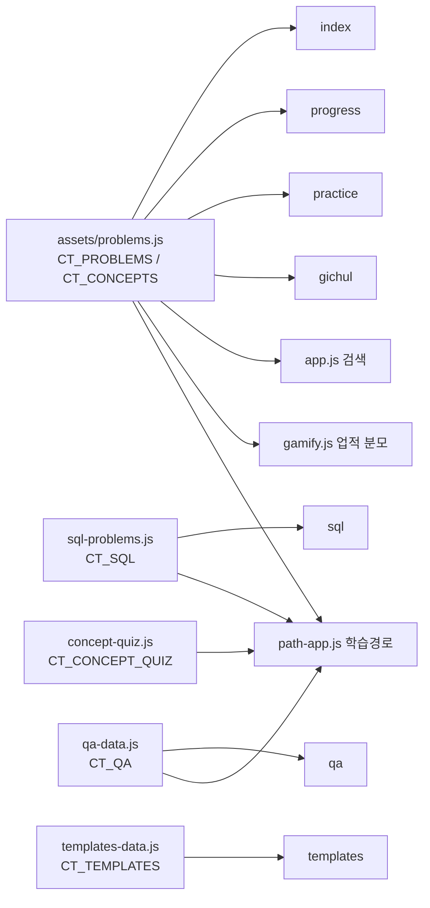
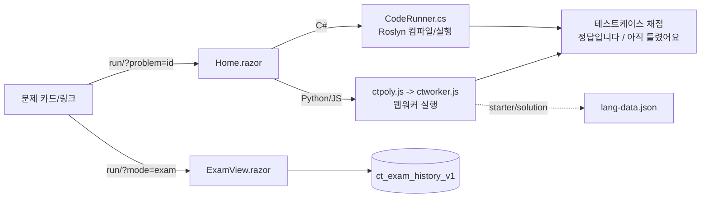
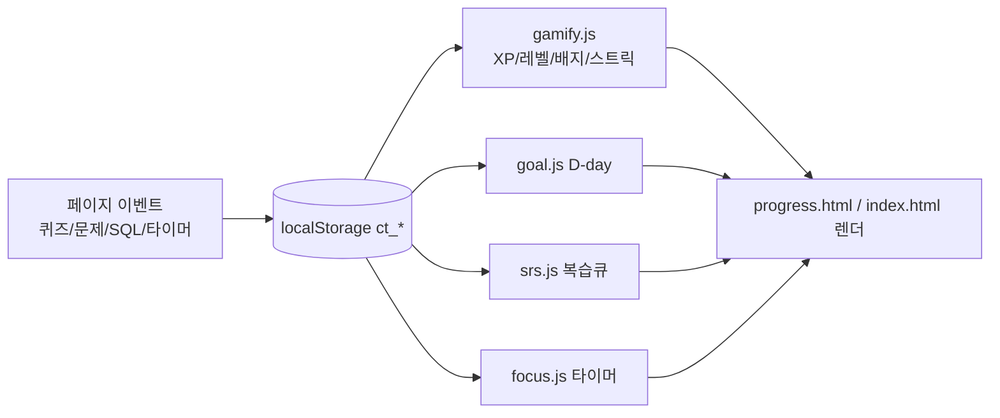
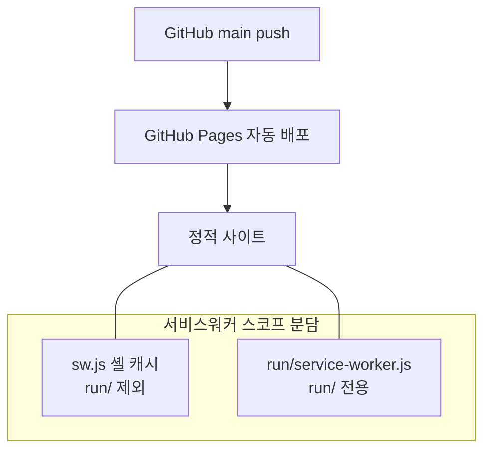
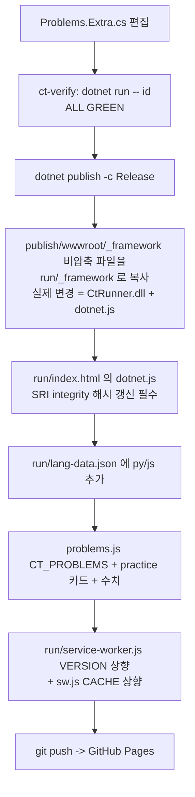

# Elice Coding Camp (coding-test-prep-cs)

엘리스 트랙 수강생을 위한 **코딩 테스트 준비 사이트**입니다. 개념 학습, 예시/기출 문제, 브라우저 안 코드 실행/채점, SQL 연습, QA 이론, 학습 경로, 게이미피케이션, 모의고사를 한곳에 모았어요.

- 라이브: https://sundae-unity-dev.github.io/coding-test-prep-cs/
- 성격: **빌드 없는 정적 사이트**(순수 HTML/CSS/JS) + 별도 **Blazor WASM 코드 실행기**(`run/`) + 선택적 **Google Apps Script** 백엔드(추적/리더보드)
- 문제 규모: 예시 74 + 기출 9 = **채점 문제 83개**(각 C#/Python/JavaScript 풀이), 개념 36주제, SQL 38문제, QA 130여 문항

이 문서는 **인수인계용**입니다. 구조/데이터 흐름/빌드 파이프라인/운영 포인트를 담았어요.

---

## 목차
1. [빠른 시작](#빠른-시작)
2. [아키텍처 개요](#아키텍처-개요)
3. [페이지](#페이지)
4. [assets 스크립트](#assets-스크립트)
5. [데이터 소스와 구조](#데이터-소스와-구조)
6. [상태 저장(localStorage)](#상태-저장localstorage)
7. [코드 실행기(run/) 와 빌드 파이프라인](#코드-실행기run-와-빌드-파이프라인)
8. [PWA / 서비스워커](#pwa--서비스워커)
9. [백엔드(Apps Script)](#백엔드apps-script)
10. [배포](#배포)
11. [문제 추가하는 법](#문제-추가하는-법)
12. [컨벤션](#컨벤션)

---

## 빠른 시작

빌드가 없어서 정적 서버로 바로 열립니다. (단, `run/` 코드 실행기는 `.wasm`/`.dll` MIME 때문에 로컬에선 정적 서버가 필요하고, 실제 검증은 라이브 URL 권장.)

```bash
# 저장소 루트에서 아무 정적 서버나
npx serve .
# 또는 python -m http.server 8000
```

브라우저에서 `http://localhost:포트/index.html`. 코드 실행기만 별도이며, 재배포는 아래 [빌드 파이프라인](#코드-실행기run-와-빌드-파이프라인) 참고.

주요 폴더:

```
/                 루트 HTML 페이지 (index, guide, concepts, ...)
/assets           공용 JS/CSS/폰트/데이터 (단일 소스 problems.js 등)
/run              Blazor WASM 코드 실행기 (빌드 산출물만 커밋, 소스는 리포 밖)
/_server          Apps Script 소스 (.gitignore 로 커밋 제외)
sw.js             셸 서비스워커(PWA)
manifest.webmanifest, icon.svg, icon-192.png   PWA
```

---

## 아키텍처 개요

### 데이터 계층 (단일 소스 -> 소비 페이지)



### 실행 계층 (코드 실행/채점)



### 상태 계층 (진행/게이미피케이션)



### 배포 / 서비스워커 스코프



---

## 페이지

로드 순서 규약(일관): `nav.js`(동기) -> `util.js`(head, 공용 유틸) -> 페이지 데이터(problems.js 등) -> `config.js` -> `tracker.js` -> `app.js` -> `gamify.js` -> 페이지 전용.

| 파일 | 역할 | 핵심 기능 |
|---|---|---|
| `index.html` | 홈/대시보드 | 진척률, 오늘의 추천 문제, 레벨/XP/스트릭, D-day, 리더보드 Top5 |
| `guide.html` | 준비 가이드 | 학습 체크리스트, 커리큘럼 안내 |
| `concepts.html` | 개념 정리 | t1~t37 본문 + 주제당 2문항 퀴즈 + 다국어 코드 토글 + 오해 포인트 (정적 콘텐츠가 대부분) |
| `practice.html` | 예시 문제 | 태그/난이도 필터 카드 -> 코드 실행기, 커뮤니티 정답률 |
| `gichul.html` | 기출 유형 | `CT_PROBLEMS` 중 `g:true` 만 카드화 |
| `progress.html` | 마이페이지 | 난이도별 진척, SRS 복습큐, 포모도로, 배지/목표, 리더보드, 데이터 내보내기 |
| `path.html` | 학습 경로 | 개발/QA 트랙 노드 + 미니퀴즈 패널 (가장 무거운 페이지) |
| `sql.html` | SQL 연습 | sql.js(SQLite WASM)로 쿼리 실행/결과 비교 채점 |
| `qa.html` | 개념정리(QA) | CS/QA 이론 + 퀴즈 + 면접 질문 |
| `templates.html` | 알고리즘 템플릿 | 카테고리별 C#/Python/JS 스니펫 + 복사 |
| `admin.html` | 관리자 집계(비공개) | `noindex`, 비밀번호 게이트 -> Apps Script 집계 조회 |
| `run/index.html` | 코드 실행기 | Monaco 에디터 + Blazor WASM (아래 별도 섹션) |

네비 메뉴 단일 소스 = `assets/nav.js` 의 `CT_NAV` 배열. "모의고사" 는 `run/?mode=exam`.

---

## assets 스크립트

| 파일 | 역할 | 노출 전역 |
|---|---|---|
| `util.js` | **공용 유틸**(ymd/todayMid/esc/lsGet/lsSet). 다른 스크립트보다 먼저 로드 | `window.ctUtil` |
| `config.js` | 추적 설정 단일 소스 | `window.CT_ENDPOINT` |
| `nav.js` | 상단 공용 네비 렌더 | (즉시실행) |
| `app.js` | 공용 유틸/셸 SW 등록/전역 검색/리더보드/정답률 | `ctProgress, ctToday, ctStampActivity, ctLeaderboard, ctProblemStats, ctAddCopy` |
| `problems.js` | **문제/개념 단일 소스** | `CT_PROBLEMS, CT_CONCEPTS` |
| `sql-problems.js` | SQL 스키마 + 문제 | `CT_SQL` |
| `qa-data.js` | QA/CS 데이터 | `CT_QA` |
| `templates-data.js` | 알고리즘 템플릿 | `CT_TEMPLATES` |
| `concept-code.js` | 개념 예제 코드 Py/JS 버전 | `CT_CONCEPT_CODE` |
| `concept-ml.js` | 개념 코드 다국어 토글 렌더러 | (즉시실행) |
| `concept-confuse.js` | 주제별 오해 포인트 callout | `CT_CONFUSE` |
| `concept-quiz.js` | 학습경로 개념 미니퀴즈(대량) | `CT_CONCEPT_QUIZ` |
| `path-app.js` | 학습 경로 앱(개발/QA 트랙) | (즉시실행) |
| `gamify.js` | XP/레벨/배지/스트릭 엔진 | `ctGamify` |
| `goal.js` | 시험 D-day 목표 | `ctGoal` |
| `srs.js` | Leitner 간격반복 복습 | `ctSrs` |
| `focus.js` | 포모도로 타이머 | `ctFocus` |
| `tracker.js` | 방문자 추적 + 시도기록 | `ctTrack` |
| `sql-wasm.js` (+ `.wasm`) | sql.js(SQLite WASM) 벤더 | (라이브러리) |

> concept 4종 구분: `concept-quiz`=학습경로 미니퀴즈 데이터, `concept-code`=예제 코드 Py/JS 번역, `concept-ml`=그 데이터를 탭으로 렌더, `concept-confuse`=오해 포인트 텍스트.

> 리팩터 노트: 여러 파일에 복붙됐던 `ymd/todayMid/esc`, 2인자 `write` 는 `util.js`(`ctUtil`)로 통합하고 각 파일은 별칭으로 연결했어요. localStorage 읽기 헬퍼는 파일마다 기본값 시맨틱(널 vs 빈객체 vs 배열)이 달라 의도적으로 파일-로컬로 남겼습니다.

---

## 데이터 소스와 구조

```js
// CT_PROBLEMS (problems.js) - 문제 단일 소스. 런박스 C# id 와 동일.
{ id, t: 제목, lv: '입문'|'기초'|'중급'|'심화', g?: true(기출), tags: [] }

// CT_CONCEPTS - 개념 주제 메타
{ id: 'tN', n: 표시번호, t: 제목, lv }

// CT_SQL (sql-problems.js)
{ setup: 'CREATE/INSERT 문자열', problems: [{ id, title, level, ordered, prompt, hint, answer }] }
// 테이블: members / orders / reviews

// CT_QA (qa-data.js) - 카테고리별 배열, 각 항목:
{ q, o: [보기], a: 정답인덱스, e: 해설 }

// CT_TEMPLATES (templates-data.js)
{ id, cat, title, note, code: { cs, py, js } }

// CT_CONCEPT_QUIZ (concept-quiz.js)
{ tN: [ { q, o, a, e } | { type:'fill'|'ox'|'multi'|'order', ... } ] }
```

문제 데이터는 `problems.js` 하나가 index 대시보드/progress/practice/gichul/path/검색/gamify 로 전파됩니다. 런박스(C# `Problems*.cs`)와는 **같은 id 를 공유**하는 수동 동기 방식이라, 문제를 추가할 땐 양쪽을 함께 고쳐야 해요([문제 추가하는 법](#문제-추가하는-법)).

---

## 상태 저장(localStorage)

서버 없이 진행 상태를 브라우저에 저장합니다. 게이미피케이션은 기록에서 매번 결정적으로 재계산해요.

| 키 | 용도 |
|---|---|
| `ct_practice_solved_v1` | 문제 통과 여부 |
| `ct_attempts_v1` | 문제별 시도/통과 수 |
| `ct_concepts_quiz_v1` | 개념정리 퀴즈 정답 |
| `ct_path_quiz_v1` / `ct_path_lessons_v1` / `ct_path_track` | 학습경로 퀴즈/레슨완료/트랙 |
| `ct_qa_quiz_v1` | QA 퀴즈 |
| `ct_sql_solved_v1` | SQL 통과 |
| `ct_guide_checklist_v1` | 가이드 체크리스트 |
| `ct_activity_v1` | 일자별 학습활동(스트릭/히트맵) |
| `ct_studytime_v1` / `ct_focus_v1` | 집중 분 / 진행중 타이머 |
| `ct_goal_v1` | 시험 목표일 |
| `ct_srs_v1` | 간격반복 박스 |
| `ct_badges_v1` / `ct_streak_freeze_v1` / `ct_daily_goal_v1` | 배지 / 스트릭 프리즈 / 하루 목표 |
| `ct_exam_history_v1` | 모의고사 결과 |
| `ct_visitor_v1` | 방문자 id/닉네임 |
| `ctprep_theme` / `ct_font_scale` | 테마 / 글자 배율 |

게이미피케이션 규칙(`gamify.js`): 문제 XP 입문10/기초15/중급25/심화40, 퀴즈 5, 모의고사 20+정답2. 레벨 = `floor(sqrt(xp/50))+1`. 배지 17종, 스트릭 프리즈(7일당 1개, 최대 3).

---

## 코드 실행기(run/) 와 빌드 파이프라인

`run/` 은 **.NET Blazor WebAssembly** 앱으로, 브라우저 안에서 Roslyn 으로 사용자 C# 코드를 실시간 컴파일/실행합니다. Python/JavaScript 는 웹워커(`ctpoly.js` -> `ctworker.js`)로 실행하고 풀이는 `lang-data.json` 에서 가져와요.

- **소스는 리포 밖**: `C:\Temp\ct-runner` (Blazor 프로젝트). 리포에는 빌드 산출물 `run/` 만 커밋.
  - `Problems.cs`(레코드 + 기본 문제), `Problems.Extra.cs`(확장), `Problems.Gichul.cs`(기출) - partial class, 합계 83, `problems.js` 와 id 일치
  - `Services/CodeRunner.cs`(Roslyn 엔진), `Pages/Home.razor`(단일 풀이), `Pages/ExamView.razor`(모의고사)
- **검증 하니스**: `C:\Temp\ct-verify` - 각 문제의 박힌 `Solution` 을 자기 `Tests` 로 채점. `dotnet run -- <id...>` 로 ALL GREEN 확인.
- **Problem 레코드**:
  ```csharp
  record TestCase(string Input, string Expected, bool Sample);
  record Problem(string Id, string Title, string Tag, string Level,
                 string Statement, string Starter, string Solution,
                 string[] Hints, TestCase[] Tests,
                 string? ExternalUrl, string? ExternalLabel);
  ```
- **csproj 핵심**(`CtRunner.csproj`): `WasmEnableWebcil=false`(PE DLL 유지 -> Roslyn 참조), `PublishTrimmed=false`, `WasmFingerprintAssets=false`(`_framework/{name}.dll` 직접 fetch).

### 재배포 파이프라인



> **주의**: 재배포 시 `dotnet.js`(부트 매니페스트)도 바뀌므로 `run/index.html` 의 preload `integrity` 해시를 새 값으로 꼭 갱신하세요(안 하면 SRI 불일치로 부팅 실패). `.gitattributes` 의 `run/** -text` 가 줄바꿈 변환을 막아 SRI 해시를 보존합니다. 정적 필드는 채점 케이스 간 유지되므로 C# 풀이는 `Main` 안에서 초기화하세요.

---

## PWA / 서비스워커

- `sw.js`(셸): `CACHE='ctcamp-shell-vN'`, **stale-while-revalidate**. SHELL 목록에 루트 HTML + 핵심 assets. `BASE+'run/'` 는 명시적으로 패스(런박스는 자체 SW). 정적 파일 바꾸면 `CACHE` 버전을 올리세요.
- `run/service-worker.js`(런박스 전용): `VERSION` 을 재배포마다 수동 상향. 네비게이션은 network-first, `_framework` 정적자산은 cache-first.
- `manifest.webmanifest`: `start_url/scope="."`(상대), `theme_color:#8843FF`. 아이콘 `icon.svg` + `icon-192.png`.

---

## 백엔드(Apps Script)

선택적입니다. `config.js` 의 `CT_ENDPOINT` 가 비면 추적이 완전히 꺼지고 사이트는 그대로 동작해요(로컬 기록만).

- `tracker.js` -> `CT_ENDPOINT`(Apps Script `.../exec`) 로 `join/visit/time/concept/code/sql/xp` 이벤트 전송(sendBeacon 우선).
- `_server/Code.gs`(**`.gitignore` 로 커밋 제외**, 로컬에만): `doPost`(시트 기록), `doGet`(JSONP) - `?board=week`(공개 리더보드), `?stats=problems`(공개 정답률), `?token=<ADMIN_PW>`(관리자 집계).
- `admin.html`: `noindex` + 비밀번호 게이트. **비밀번호(ADMIN_PW)는 사이트가 아니라 Apps Script 안에** 둡니다.

---

## 배포

- **GitHub Pages** (repo `Sundae-unity-dev/coding-test-prep-cs`, `main` push 시 자동). `.nojekyll` 로 언더스코어 폴더(`_framework`) 서빙.
- **base 경로 자동감지**: `sw.js`/`run/service-worker.js` 가 자기 파일 위치의 pathname 에서 폴더를 잘라 base 로 사용 -> 서브경로(`/coding-test-prep-cs/`)와 루트 배포 겸용. 페이지 자산은 상대경로.
- 향후 최적화(참고): `path.html` 이 concept-quiz.js(대용량) 등을 한 번에 로드하는 최중량 페이지 -> 지연로드하려면 `path-app.js` 가 init 에서 `CT_CONCEPT_QUIZ` 를 캡처하는 부분을 지연 참조로 바꿔야 함.

---

## 문제 추가하는 법

### 알고리즘 채점 문제 (런박스)
[재배포 파이프라인](#재배포-파이프라인) 그대로: `Problems.Extra.cs` 에 `Problem` 추가 -> `ct-verify` ALL GREEN -> publish -> `run/_framework` 복사 -> `run/index.html` SRI 갱신 -> `lang-data.json` py/js -> `problems.js` + `practice.html` 카드 + 수치 -> SW 버전 상향.

### SQL 문제 (빌드 불필요)
`assets/sql-problems.js` 의 `problems` 배열에 `{ id, title, level, ordered, prompt, hint, answer }` 추가. `answer` 쿼리 실행 결과가 정답. 기존 테이블(members/orders/reviews) 재사용. sql.js 는 SQLite 3.45(윈도우 함수/CTE 지원).

### 개념/QA/템플릿 (빌드 불필요)
각각 `CT_CONCEPTS`+concepts.html, `CT_QA`+qa.html, `CT_TEMPLATES` 데이터에 추가.

---

## 컨벤션

- **폰트**: 본문 `Elice DX Neolli`, 코드 `Elice Digital Coding`(`assets/fonts/`), 없으면 Pretendard/Cascadia 폴백.
- **브랜드 컬러**: 퍼플 `#8843FF`. 디자인 토큰은 `assets/app.css` `:root`(라이트) + `html[data-theme="dark"]`(다크)에 단일 정의. 페이지 고유 토큰만 인라인 `:root` 에 남김.
- **다크모드**: 각 페이지 `<head>` 인라인 스니펫으로 FOUC 방지(의도적 중복), 토글은 `app.js`.
- **문체**: UI/주석 모두 한국어 정중체("~해요/~돼요").
- **문안 규칙**: 가운뎃점/줄표(em/en dash)/곡선따옴표/말줄임표/곱셈기호(x)를 쓰지 않고 일반 ASCII(하이픈/슬래시/x)를 사용. 이모지는 배지/토스트 등 기능적 용도만.

---

*이 문서는 인수인계를 위해 작성됐어요. 구조가 바뀌면 함께 갱신해 주세요.*
